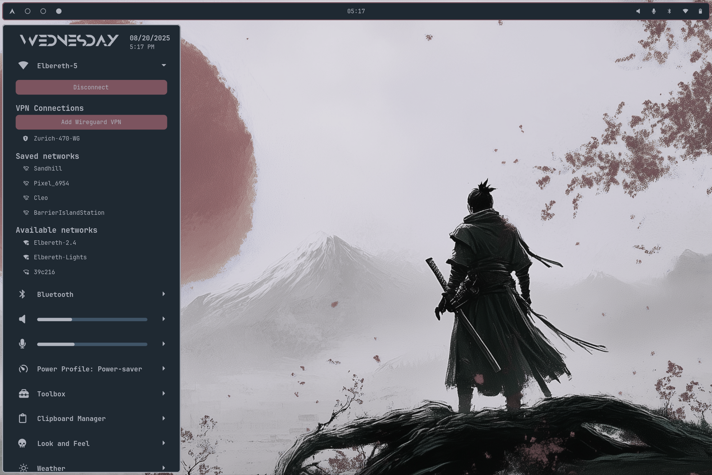

# OkPanel

A panel for Hyprland, built on AGS/Astal

This project is quite usable, but still in a pre-release state.  There may be breaking changes as development continues.

## [Check out the docs to get started](https://johnoberhauser.github.io/OkPanel/)

